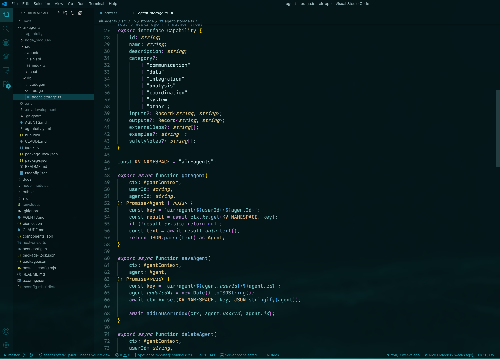

# Agentuity Theme

A dark VSCode theme with cyan/turquoise accents that matches www.agentuity.com branding.

## Screenshots



The theme features vibrant cyan/turquoise highlights on a deep dark background, optimized for comfortable coding sessions.

## Installation

### Install from VSIX Package

To share your theme or install it on another machine:

1. Package the theme:
   ```bash
   npx vsce package
   ```

2. This creates an `agentuity-theme-1.0.0.vsix` file

3. Install the VSIX file:
   - Open VSCode
   - Go to Extensions view (`Ctrl+Shift+X` or `Cmd+Shift+X`)
   - Click the `...` menu at the top of the Extensions view
   - Select "Install from VSIX..."
   - Choose the `.vsix` file

### Manual Installation

1. Copy this entire directory to your VSCode extensions folder:
   - **Windows**: `%USERPROFILE%\.vscode\extensions\`
   - **macOS**: `~/.vscode/extensions/`
   - **Linux**: `~/.vscode/extensions/`

2. Reload VSCode
3. Select the theme from the Color Theme picker

## Customization

If you want to customize specific colors, add this to your `settings.json`:

```json
"workbench.colorCustomizations": {
  "[Agentuity]": {
    "editor.background": "#your-color-here"
  }
}
```

## Feedback

If you have suggestions or find issues, please report them in the repository.

## License

See LICENSE file for details.
